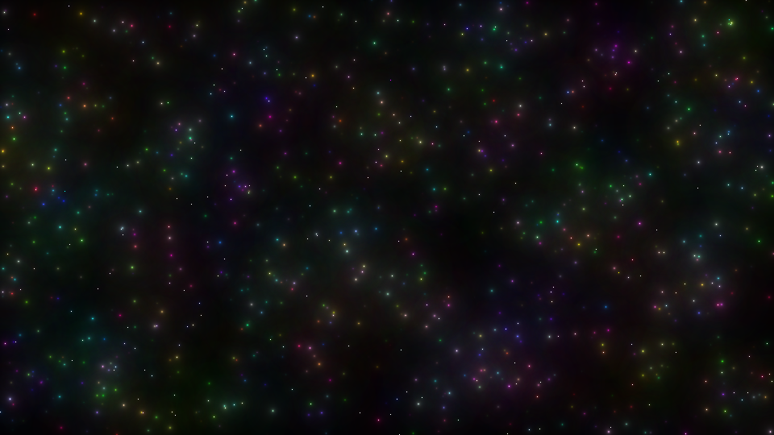
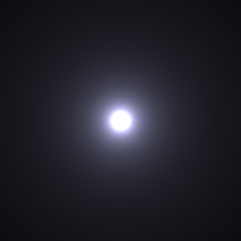

# Stars

Generates Images filled with stars. Currently the Stars are rendered randomly and the properties (resolition, count of stars,...) are hardcoded.

## Motivation

Generating awesome images in Plain C without any libraries (including the bitmap writer).

## Installation

- `git clone https://evilc00kie@bitbucket.org/evilc00kie/stars.git`
- `cd stars`
- `make`

## Usage

`stars` is designed as a filter and awaits, as such, a resolution and a list of stars.

For example:
```bash
[13:23:23][raphael@togobian:~/dev/stars]$ ./stars
1500 1500
50 50 50 50 50 50.0
10 100 60 10 10 10.0
150 15 150 150 15.0
1000 750 220 220 255 100.0
Wrote 6750054 bytes to ./examples/starout00009.bmp
```

This will generate the following image:


Another method would be to store the input in a file and redirect it into the
standard input.

`./stars < starsin1` or `cat starsin1|./stars`


### Test Image

Use the Switch `t` to generate a test image. This doesn't need any input.
This will generate the following image.


## References

- Idea for making stars + Algorithm: https://codegolf.stackexchange.com/q/53124
- Bitmap Writer: https://stackoverflow.com/a/2654860

## License
LGPL
