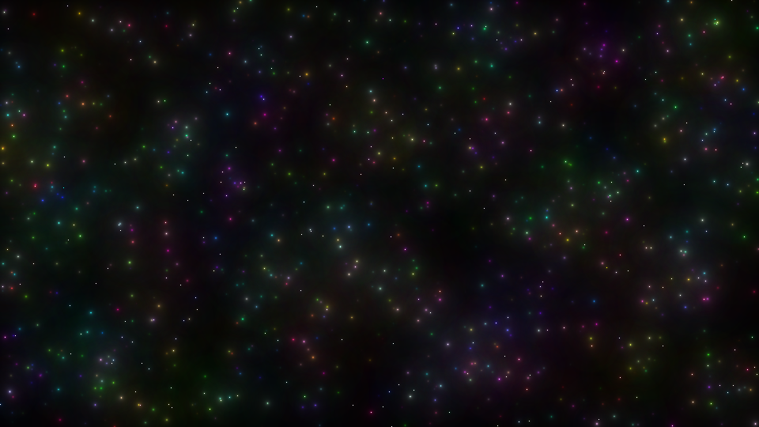
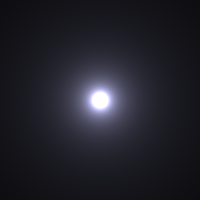
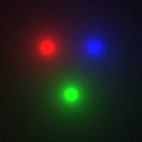

# Stars

Generates Images filled with stars. 

## Motivation

Generating awesome images in Plain C without any libraries (including the bitmap writer).

## Installation

- `git clone https://evilc00kie@bitbucket.org/evilc00kie/stars.git`
- `cd stars`
- `make`

## Usage

`stars` is designed as a filter and awaits, as such, a resolution and a list of stars.

For example:
```bash
~/dev/stars$ ./stars
400 400
200 200 200 200 255 20.0
Wrote 6750054 bytes to ./examples/starout00009.bmp
```

This will generate an 400x400 large image with one white-bluish (looks more realistic than pure white) star in the center. The star has the following properties (in the same order than the input line):

- x coordinate (mustn't be inside the resolution)
- y coordinate (mustn't be inside the resolution)
- red (between 0 and 255)
- green (between 0 and 255)
- blue (between 0 and 255)
- intensity (>0, float)



Another method would be to store the input in a file and redirect it into the
standard input.

`./stars < starsin1` or `cat starsin1|./stars`


### Test Image

Use the Switch `t` to generate a test image. This doesn't need any input.



## References

- Idea for making stars + Algorithm: https://codegolf.stackexchange.com/q/53124
- Bitmap Writer: https://stackoverflow.com/a/2654860

## License
GPL
